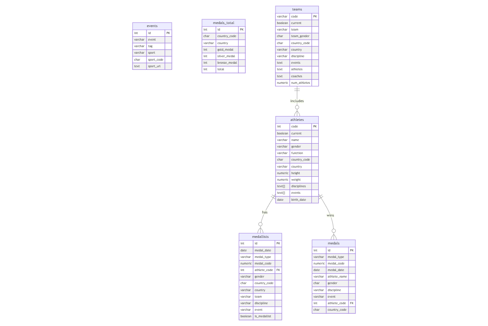

# Design Document

By Panagiotis Chatzinikolaou

Video overview: [Tokyo Olympics 2024 Database](https://youtu.be/me3gPBSj7ig)

## Scope

This is the final project for CS50's course "Introduction to Databases with SQL". In this project, I created a relational database in PostgreSQL using the 2024 Tokyo Olympics dataset. The project includes all entities necessary to facilitate the process of tracking athlete participation, medal distribution, and country performance in the Olympics. Data were downloaded as CSV files from Kaggle and then copied in tables in a POSTGRES database named "tokyo_olympics_2024". The tables included in the database are:

- Athletes, including athlete personal information and associated disciplines
- Medals, including the type, event, and athlete who won them
- Countries, with their respective medal counts and participant details
- Events, specifying the disciplines and events in the Olympics
- Teams, capturing team details, associated athletes, and coaches

Out of scope were elements like nocs, schedules, vanues, technical officials, schedule_preliminary, and coaches.

## Functional Requirements

This project supports:

- CRUD operations for athletes, events, and teams
- Tracking athlete participation across disciplines and events
- Recording medal distributions by athletes, events, and countries
- Reporting on top-performing athletes, countries, and disciplines
- Views and JOINS

## Representation
The below entity relationship diagram describes the relationships among the entities in the PostgreSQL database.



As detailed by the diagram:

#### Athletes
The `athletes` table includes:
- `code` (SERIAL PRIMARY KEY): Unique identifier for each athlete, auto-incremented.
- `current` (BOOLEAN): Indicates whether the athlete is currently active.
- `name` (VARCHAR(255)): Full name of the athlete.
- `name_short` (VARCHAR(255)): Shortened or preferred name of the athlete.
- `name_tv` (VARCHAR(255)): Name format suitable for TV displays or broadcasts.
- `gender` (VARCHAR(10)): Gender of the athlete (e.g., `Male`, `Female`).
- `function` (VARCHAR(50)): Role or function of the athlete (e.g., `Competitor`, `Coach`).
- `country_code` (CHAR(3)): Three-character ISO code representing the athlete's country.
- `country` (VARCHAR(100)): Common name of the athlete's country.
- `country_long` (VARCHAR(100)): Full or formal name of the athlete's country.
- `nationality_code` (VARCHAR(100)): Code representing the athlete's nationality.
- `nationality` (VARCHAR(100)): Athlete's nationality in common terms.
- `nationality_long` (VARCHAR(100)): Formal or full representation of the athlete's nationality.
- `height` (NUMERIC): Athlete's height in meters or centimeters.
- `weight` (NUMERIC): Athlete's weight in kilograms.
- `disciplines` (TEXT[]): Array of sports or disciplines the athlete participates in.
- `events` (TEXT[]): Array of specific events the athlete competes in.
- `birth_date` (DATE): Athlete's date of birth.
- `birth_place` (VARCHAR(255)): City or town where the athlete was born.
- `birth_country` (VARCHAR(100)): Country where the athlete was born.
- `residence_place` (VARCHAR(255)): Current city or town of residence.
- `residence_country` (VARCHAR(100)): Current country of residence.
- `nickname` (TEXT): Athlete's nickname or informal moniker.
- `hobbies` (TEXT): Athlete's interests or activities outside of sports.
- `occupation` (TEXT): Athlete's profession or occupation (if applicable).
- `education` (TEXT): Details about the athlete's educational background.
- `family` (TEXT): Information about the athlete's family or family members.
- `lang` (TEXT): Languages spoken by the athlete.
- `coach` (TEXT): Names of the athlete's coaches.
- `reason` (TEXT): Athlete's motivation or reason for pursuing their sport.
- `hero` (TEXT): Athlete's role models or heroes.
- `influence` (TEXT): Influential figures or factors in the athlete's life.
- `philosophy` (TEXT): Athlete's philosophy or personal outlook on sports and life.
- `sporting_relatives` (TEXT): Details about family members also involved in sports.
- `ritual` (TEXT): Pre-competition rituals or routines.
- `other_sports` (TEXT): Other sports the athlete participates in or has experience with.

#### Events
The `events` table includes:
- `id` (SERIAL PRIMARY KEY): Unique identifier for each event.
- `event` (VARCHAR(255)): Name of the event.
- `tag` (VARCHAR(50)): Tag or category associated with the event.
- `sport` (VARCHAR(100)): Name of the sport associated with the event.
- `sport_code` (CHAR(3)): Three-character code representing the sport.
- `sport_url` (TEXT): URL linking to additional details about the sport.

#### Medallists
The `medallists` table includes:
- `id` (SERIAL PRIMARY KEY): Unique identifier for each medallist record.
- `medal_date` (DATE): Date when the medal was awarded.
- `medal_type` (VARCHAR(50)): Type of medal (e.g., Gold, Silver, Bronze).
- `medal_code` (NUMERIC): Code representing the medal type.
- `athlete_code` (INT REFERENCES athletes(code)): Reference to the athlete who won the medal.
- `gender` (VARCHAR(10)): Gender of the medallist.
- `country_code` (CHAR(3)): Three-character ISO code for the medallist's country.
- `country` (VARCHAR(100)): Common name of the medallist's country.
- `country_long` (VARCHAR(100)): Full or formal name of the medallist's country.
- `nationality_code` (CHAR(3)): Code representing the medallist's nationality.
- `nationality` (VARCHAR(100)): Common name of the medallist's nationality.
- `nationality_long` (VARCHAR(100)): Full representation of the medallist's nationality.
- `team` (VARCHAR(255)): Name of the team the medallist belongs to (if applicable).
- `team_gender` (VARCHAR(10)): Gender category of the team (e.g., Male, Female, Mixed).
- `discipline` (VARCHAR(100)): Discipline associated with the medal.
- `event` (VARCHAR(255)): Event for which the medal was awarded.
- `event_type` (VARCHAR(10)): Type of the event (e.g., Individual, Team).
- `url_event` (TEXT): URL linking to the event details.
- `birth_date` (DATE): Birth date of the medallist.
- `is_medallist` (BOOLEAN): Indicates whether the athlete is a medallist.

#### Medals
The `medals` table includes:
- `id` (SERIAL PRIMARY KEY): Unique identifier for each medal record.
- `medal_type` (VARCHAR(50)): Type of medal (e.g., Gold, Silver, Bronze).
- `medal_code` (NUMERIC): Code representing the medal type.
- `medal_date` (DATE): Date when the medal was awarded.
- `athlete_name` (VARCHAR(255)): Name of the athlete who won the medal.
- `gender` (CHAR(1)): Gender of the athlete (e.g., M for Male, F for Female).
- `discipline` (VARCHAR(100)): Discipline associated with the medal.
- `event` (VARCHAR(255)): Event for which the medal was awarded.
- `event_type` (VARCHAR(10)): Type of the event (e.g., Individual, Team).
- `url_event` (TEXT): URL linking to the event details.
- `athlete_code` (INT REFERENCES athletes(code)): Reference to the athlete's record.
- `country_code` (CHAR(3)): Three-character ISO code for the athlete's country.
- `country` (VARCHAR(100)): Common name of the athlete's country.
- `country_long` (VARCHAR(100)): Full or formal name of the athlete's country.

#### Medals total
The `medals_total` table includes:
- `id` (SERIAL PRIMARY KEY): Unique identifier for each record.
- `country_code` (CHAR(3)): Three-character ISO code for the country.
- `country` (VARCHAR(100)): Common name of the country.
- `country_long` (VARCHAR(100)): Full or formal name of the country.
- `gold_medal` (INT): Total number of gold medals won by the country.
- `silver_medal` (INT): Total number of silver medals won by the country.
- `bronze_medal` (INT): Total number of bronze medals won by the country.
- `total` (INT): Total number of medals won by the country.

#### Teams
The `teams` table includes:
- `code` (VARCHAR(50) PRIMARY KEY): Unique identifier for each team.
- `current` (BOOLEAN): Indicates whether the team is currently active.
- `team` (VARCHAR(255)): Name of the team.
- `team_gender` (CHAR(1)): Gender category of the team (e.g., M for Male, F for Female, X for Mixed).
- `country_code` (CHAR(3)): Three-character ISO code for the team's country.
- `country` (VARCHAR(100)): Common name of the team's country.
- `country_long` (VARCHAR(100)): Full or formal name of the team's country.
- `discipline` (VARCHAR(100)): Discipline the team participates in.
- `disciplines_code` (CHAR(3)): Three-character code representing the discipline.
- `events` (TEXT): List of events the team competes in.
- `athletes` (TEXT): List of athlete names on the team.
- `coaches` (TEXT): List of coach names for the team.
- `athletes_codes` (TEXT): List of athlete codes for the team members.
- `num_athletes` (NUMERIC): Total number of athletes on the team.
- `coaches_codes` (TEXT): List of coach codes for the team's coaches.
- `num_coaches` (NUMERIC): Total number of coaches for the team.

### Relationships


The relationships among the entities are defined as follows:

- athletes and medallists: Each medallist is linked to an athlete via the athlete_code field, establishing a one-to-many relationship (one athlete can have multiple medals, but each medal is associated with one athlete).

- athletes and medals: Similar to the medallists table, medals are linked to athletes through the athlete_code field, creating another one-to-many relationship.

- medals_total: The medals_total table aggregates medal counts by country, providing a summary of the data in the medallists or medals tables.

- teams and athletes: Teams contain lists of athletes and their codes, representing a one-to-many or many-to-many relationship depending on the team composition.

- events and other tables: Events represent the competitions, linking indirectly to medals and medallists via the event details in both the medallists and medals tables. Each event is related to one or more disciplines.

## Queries

Here are some of the key queries supported by the database:

1. Find the total number of Greek athletes:
   ```sql
   SELECT COUNT("name") AS "Total_Greek_Athletes"
   FROM "athletes"
   WHERE "country" = 'Greece';
   ```

2. Find the athlete who won the most medals:
   ```sql
   SELECT "athlete_name", COUNT("medal_type") AS "total_medals"
   FROM "medals"
   GROUP BY "athlete_name"
   ORDER BY "total_medals" DESC
   LIMIT 1;
   ```

3. Find the top 10 countries by total medals:
   ```sql
   CREATE VIEW "top_10_medal_countries" AS
   SELECT "country", "gold_medal", "silver_medal", "bronze_medal", "total"
   FROM "countries"
   ORDER BY "total" DESC
   LIMIT 10;
   ```

4. Find all athletes who won medals in Athletics:
   ```sql
   SELECT "athletes"."name" AS "athlete_name", "medals"."medal_type"
   FROM "medals"
   JOIN "athletes" ON "medals"."athlete_code" = "athletes"."code"
   WHERE "medals"."discipline" = 'Athletics';
   ```

5. Find the total number of athletes and medallists:
   ```sql
   SELECT COUNT(DISTINCT "athletes"."code") AS "total_participants",
          COUNT(DISTINCT "medals"."athlete_code") AS "total_medallists"
   FROM "athletes"
   LEFT JOIN "medals" ON "athletes"."code" = "medals"."athlete_code";
   ```

## Optimizations

To enhance performance for frequent queries, the following indexes were created:
- Index on medals (athlete_code) to efficiently join medal records with athlete details.
- Index on medallists (athlete_code) to efficiently search for medallists by athlete.
- Index on medals (country_code) to speed up queries aggregating medals by country.
- Index on medallists (country_code) to speed up searches for medallists by country.
- Index on medals_total (country_code) to speed up searches for total medal counts by country.
- Index on medals (medal_type) to optimize searches for medals by type (e.g., gold, silver, bronze).
- Index on medals (discipline, event) to optimize searches for medals by both discipline and event.
- Index on medallists (discipline, event) to optimize searches for medallists by discipline and event.
- Index on medallists (country_code, discipline) to speed up searches for medallists by country and discipline.

## Limitations

The current schema assumes structured data and clean inputs. Two csv files ("athletes" and "medals") were slightly modified for ease of insertion in the database. Handling malformed arrays or inconsistent date formats requires preprocessing. Future versions could incorporate more queries for cleaning and processing the dataset, to avoid manually cleaning of csv files.

## Data source
https://www.kaggle.com/datasets/piterfm/paris-2024-olympic-summer-games
